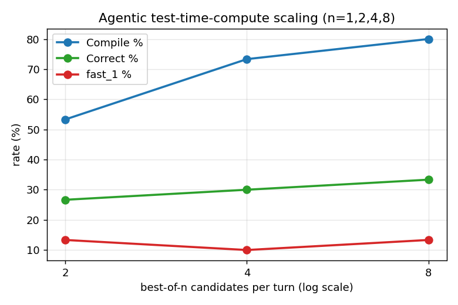

# Correct First, Fast Second

**What a local 7B code model can and cannot do for GPU kernel optimization.**

A controlled study of how much the *interaction strategy* around a fixed, locally hosted
code model (Qwen2.5‑Coder‑7B‑Instruct) affects its ability to replace PyTorch operators
with custom CUDA kernels, measured on [KernelBench](https://github.com/ScalingIntelligence/KernelBench).
Holding the model constant, we compare four regimes of increasing structure — **zero‑shot**,
**profiling‑guided**, **iterative** refinement, and a five‑role **agentic** loop — and ablate
the agent component‑by‑component.

The full write‑up is in [`report.tex`](report.tex) (and an arXiv‑formatted version in
[`report_arxiv.tex`](report_arxiv.tex)); a generated results report lives in
[`report/REPORT.md`](report/REPORT.md).

---

## Headline results

30 KernelBench tasks (levels 1–3, first 10 each), evaluated on a V100. `fast₁` = correct
**and** faster than eager PyTorch.

| Method | Compile % | Correct % | fast₁ % | Geo‑mean speedup |
|---|---|---|---|---|
| Zero‑shot | 70 | 30 | 13 | 0.98× |
| **Guided** | **77** | **43** | **27** | 0.99× |
| Iterative | 67 | 30 | 10 | 0.98× |
| Agentic | 73 | 30 | 10 | 0.97× |

Three findings:

1. **Correctness, not speed, is the binding constraint.** Even *correct* kernels average
   0.97–0.99× eager PyTorch — a 7B model cannot out‑write cuBLAS/cuDNN on dense GEMM/conv;
   the only real wins are fused memory‑bound epilogues.
2. **The best strategy depends on difficulty.** Guided prompting wins overall and uniquely
   cracks level‑3 networks, but the agentic loop is the *only* method that solves any
   level‑2 fusion problem (3/10 vs. 0/10 for everything else).
3. **Naïve agentic scaffolding is harmful.** Our first agent scored 3% correct — *below*
   zero‑shot — by pushing the model toward custom CUDA it could not compile. The fixes that
   recovered it (3%→30%) were matching the agent's ambition to the model's competence and
   spending compute on **best‑of‑n sampling under a real execution oracle**, not on more
   reasoning steps. Removing best‑of‑n alone collapses the agent back to 3%.



---

## Repository layout

```
.
├── data.json                 # zero-shot prompts for all 30 tasks (levels 1-3 × 10)
├── data_guided.json          # same tasks, prompts enriched with reference GPU profiling
├── zeroshot/ guided/         # the four methods; each has a main.py that runs local Qwen
│   iterative/ agentic/
│     agentic/                 # the multi-agent loop (see docs/AGENTIC_METHOD.md)
│       llm.py rag.py agents.py evaluator.py pipeline.py datacollector.py main.py
│       docs/                  # RAG documentation corpus (BM25-indexed)
│       selftest.py            # offline orchestration test (no GPU)
├── experiments/              # unified orchestration layer (start here)
│     config.py                # single source of truth: model, methods, ablations, paths
│     run_experiment.py        # run ONE (model, method) cell end to end
│     make_report.py           # aggregate all cells -> CSVs + REPORT.md + figures
│     run_all_experiments.sh   # full sweep (core methods + agentic ablations) on SLURM
│     runs/<run_dir>/          # per-cell outputs: gen_results.json, summary.{json,md}
├── KernelBench/              # vendored benchmark + eval harness (MIT; see its LICENSE)
├── docs/AGENTIC_METHOD.md    # formal description of the agentic system + ablations
└── report/                   # paper artifacts: PAPER.md, data/*.csv, figures/*.png
```

## The four methods

| Method | What it does |
|---|---|
| **Zero‑shot** | Raw KernelBench prompt, greedy, one attempt — the capability floor. |
| **Guided** | Prompt enriched with reference GPU profiling + a roofline rule ("don't reimplement cuBLAS/cuDNN; fuse the memory‑bound epilogue instead"). |
| **Iterative** | Up to 3 turns of generate → compile/check/time → distilled feedback → regenerate. |
| **Agentic** | Five roles on the *same* model — Code Analyzer, RAG Researcher, Kernel Generator (best‑of‑n), Evaluator (non‑LLM), Feedback Analyzer — looped under a real evaluator. See [`docs/AGENTIC_METHOD.md`](docs/AGENTIC_METHOD.md). |

## Setup

```bash
# Python 3.10. A CUDA toolkit (nvcc) and GCC >= 9 must be on PATH so that
# torch.utils.cpp_extension can build the generated kernels.
pip install -r requirements.txt
# torch must match your CUDA build, e.g.:
#   pip install torch==2.5.1 --index-url https://download.pytorch.org/whl/cu121
```

Verify the agentic orchestration without a GPU:

```bash
python agentic/selftest.py
```

## Reproducing the study

Everything is driven from `experiments/`. A single (model, method) cell, end to end
(generate → evaluate → analyze → summarize), requires GPUs:

```bash
python experiments/run_experiment.py --model qwen --method guided
python experiments/run_experiment.py --model qwen --method agentic
```

The full sweep — four core methods plus the agentic ablations and best‑of‑n sweep — is a
single SLURM job; it is idempotent (completed cells are skipped):

```bash
sbatch experiments/run_all_experiments.sh
```

Rebuild the report, tables, and figures from existing evaluation results (no GPU):

```bash
python experiments/make_report.py     # writes report/REPORT.md, report/data/*.csv, report/figures/*.png
```

To change the study size, edit `PROBLEMS_PER_LEVEL` in `experiments/config.py` and re‑run;
the data/profiling/baseline artifacts regenerate automatically.

## Benchmark and model

- **Benchmark:** [KernelBench](https://github.com/ScalingIntelligence/KernelBench), levels 1–3,
  first 10 problems each (30 tasks). The benchmark and its evaluation harness are vendored
  under [`KernelBench/`](KernelBench/) and remain under their own MIT license.
- **Model:** [Qwen2.5‑Coder‑7B‑Instruct](https://huggingface.co/Qwen/Qwen2.5-Coder-7B-Instruct),
  run locally via HuggingFace Transformers (fp16). No proprietary model or API is used.
- **Hardware / baseline:** evaluation on a Tesla V100‑SXM2‑32GB; the speed baseline is eager PyTorch.

## Citation

```bibtex
@misc{tsou2026correctfirst,
  title  = {Correct First, Fast Second: What a Local 7B Code Model
            Can and Cannot Do for GPU Kernel Optimization},
  author = {Tsou, Eric},
  year   = {2026},
  note   = {Preprint}
}
```

## Acknowledgements

This work builds directly on [KernelBench](https://github.com/ScalingIntelligence/KernelBench)
(Ouyang et al.) and [Qwen2.5‑Coder](https://huggingface.co/Qwen). Experiments were run on the
Taiwania 2 GPU cluster.

## License

This repository's own code and write‑up are released under the [MIT License](LICENSE). The
vendored `KernelBench/` directory retains its own MIT license; see `KernelBench/LICENSE`.
