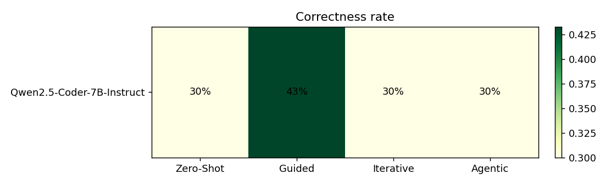
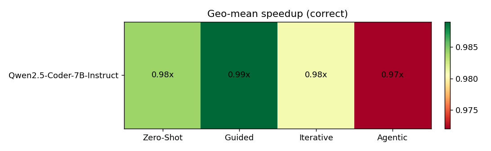
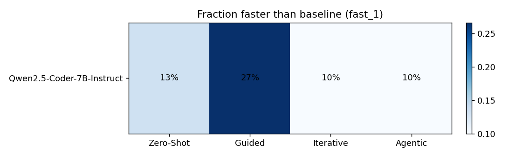

# LLM-Based Kernel Improvement on KernelBench — Results Report

Auto-generated by `experiments/make_report.py`. Tables and figures refresh from the latest eval results; the prose sections are scaffolds to expand.

## 1. Experimental setup

- **Benchmark:** KernelBench, levels [1, 2, 3], first 10 problems each (**30 tasks**).
- **Hardware:** V100_SXM2_32GB (Volta); baseline = eager PyTorch (`baseline_time_torch`).
- **Models:** Qwen2.5-Coder-7B-Instruct (`qwen`, local).
- **Methods:** Zero-Shot; Guided; Iterative; Agentic.
- **Design:** 1×4 = 4 cells; **11 complete**, 0 pending.

**Metrics.** *Compilation rate* = fraction that build; *correctness rate* = fraction matching the reference within tolerance; *fast_1* = fraction that are both correct and faster than eager PyTorch; *geo-mean speedup* = geometric mean of (baseline/kernel) runtime over correct samples (>1 is faster).

## 2. Headline comparison (all levels pooled)

### 2.1 Correctness rate

| model \ method | Zero-Shot | Guided | Iterative | Agentic |
|---|---|---|---|---|
| Qwen2.5-Coder-7B-Instruct | 30% | 43% | 30% | 30% |

### 2.2 Geometric-mean speedup (correct samples)

| model \ method | Zero-Shot | Guided | Iterative | Agentic |
|---|---|---|---|---|
| Qwen2.5-Coder-7B-Instruct | 0.98x | 0.99x | 0.98x | 0.97x |

### 2.3 Faster-than-baseline rate (fast_1)

| model \ method | Zero-Shot | Guided | Iterative | Agentic |
|---|---|---|---|---|
| Qwen2.5-Coder-7B-Instruct | 13% | 27% | 10% | 10% |

### 2.4 Compilation rate

| model \ method | Zero-Shot | Guided | Iterative | Agentic |
|---|---|---|---|---|
| Qwen2.5-Coder-7B-Instruct | 70% | 77% | 67% | 73% |

## 3. Heatmaps

## 4. Per-level breakdown

Correctness count (out of 10) per level, per cell.

| model | method | L1 | L2 | L3 |
|---|---|---|---|---|
| Qwen2.5-Coder-7B-Instruct | Zero-Shot | 9 | 0 | 0 |
| Qwen2.5-Coder-7B-Instruct | Guided | 10 | 0 | 3 |
| Qwen2.5-Coder-7B-Instruct | Iterative | 9 | 0 | 0 |
| Qwen2.5-Coder-7B-Instruct | Agentic | 5 | 3 | 1 |

## 5. Error taxonomy

Counts per failure category (correct/slow cells excluded from failure buckets).

| model | method | no_code | compilation | hallucinated_api | memory | shape_mismatch | wrong_output | runtime | timeout | slow | unknown |
|---|---|---|---|---|---|---|---|---|---|---|---|
| Qwen2.5-Coder-7B-Instruct | Zero-Shot | 0 | 7 | 4 | 1 | 5 | 4 | 0 | 0 | 5 | 0 |
| Qwen2.5-Coder-7B-Instruct | Guided | 0 | 5 | 6 | 0 | 3 | 3 | 0 | 0 | 5 | 0 |
| Qwen2.5-Coder-7B-Instruct | Iterative | 0 | 9 | 3 | 1 | 4 | 4 | 0 | 0 | 6 | 0 |
| Qwen2.5-Coder-7B-Instruct | Agentic | 0 | 8 | 8 | 0 | 0 | 5 | 0 | 0 | 6 | 0 |

## 6. Agentic ablation study

The full agentic system is the multi-agent loop (Code Analyzer + RAG Researcher + Kernel Generator + Evaluator + Feedback Analyzer) over a best-of-4 backbone. Each row below flips exactly one component off against that same backbone, so the gap to the full system isolates that component's contribution. See `docs/AGENTIC_METHOD.md`.

### 6.1 Component ablations (best-of-4 backbone)

| variant | correct% | fast_1% | geo-mean speedup | compile% | tasks |
|---|---|---|---|---|---|
| **Agentic (full)** | 30% | 10% | 0.97x | 73% | 30 |
| − RAG Researcher | 20% | 7% | 0.97x | 77% | 30 |
| − Code Analyzer | 20% | 10% | 0.99x | 63% | 30 |
| − Feedback Analyzer | 37% | 10% | 0.96x | 73% | 30 |
| − Refinement loop (1 turn) | 20% | 10% | 0.98x | 70% | 30 |
| − best-of-n (greedy, n=1) | 3% | 0% | 0.95x | 23% | 30 |

### 6.2 Test-time-compute: best-of-n sweep

Full agentic system, varying only the number of candidates sampled and evaluated per turn (the Evaluator keeps the best). n=1 is greedy; n=4 is the headline system. This isolates the compute-for-quality trade-off.

| best-of-n | correct% | fast_1% | geo-mean speedup | compile% | tasks |
|---|---|---|---|---|---|
| n=2 | 27% | 13% | 0.98x | 53% | 30 |
| n=4 | 30% | 10% | 0.97x | 73% | 30 |
| n=8 | 33% | 13% | 0.98x | 80% | 30 |

## 7. Discussion (to write)

- How much does richer guidance (guided / iterative / agentic) lift the local Qwen model over plain zero-shot?
- Iterative vs agentic: does explicit planning + self-critique beat plain feedback loops?
- Ablations: which agent (RAG, Code Analyzer, Feedback Analyzer) contributes most? Does best-of-n trade compute for quality favourably?
- How does each method degrade from level 1 → 3 as problems get harder?
- Reasoning overhead vs payoff: turns spent vs speedup gained.

## 8. Artifacts

- Per-cell detail: `experiments/runs/<run_dir>/summary.md` (per-problem table, turns, categories).
- Machine-readable: `report/data/*.csv`.
- Raw generations + logs: `experiments/runs/<run_dir>/`.
